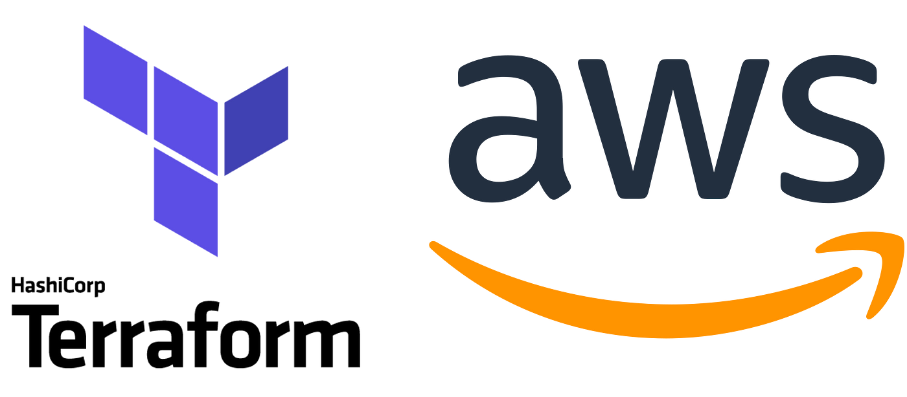

## **DataOps: Fazendo deploy com AWS e Terraform**

### Para executar este projeto basta seguir os passos abaixo:

1. Fazer o git clone
2. Fazer o comando docker build -t app-streamlit .
3. E por último fazer o comando docker run -p 8501:8501 app-streamlit
   
